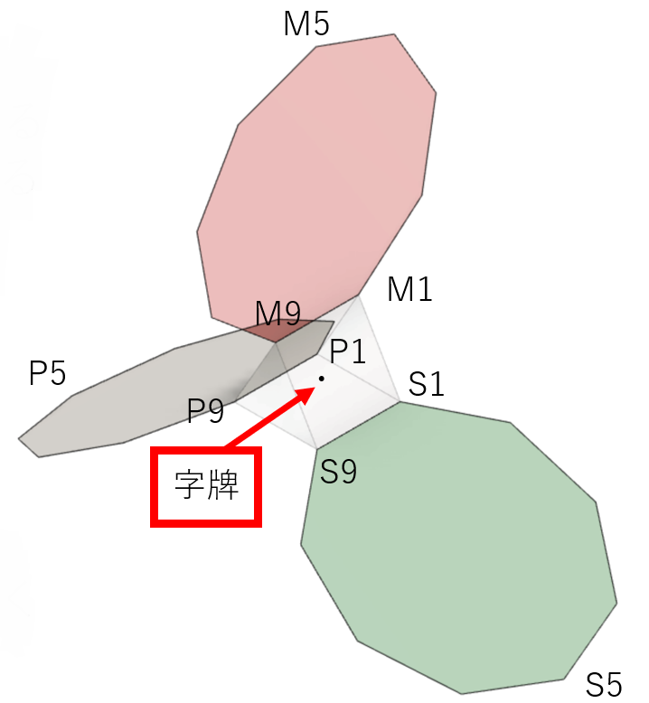
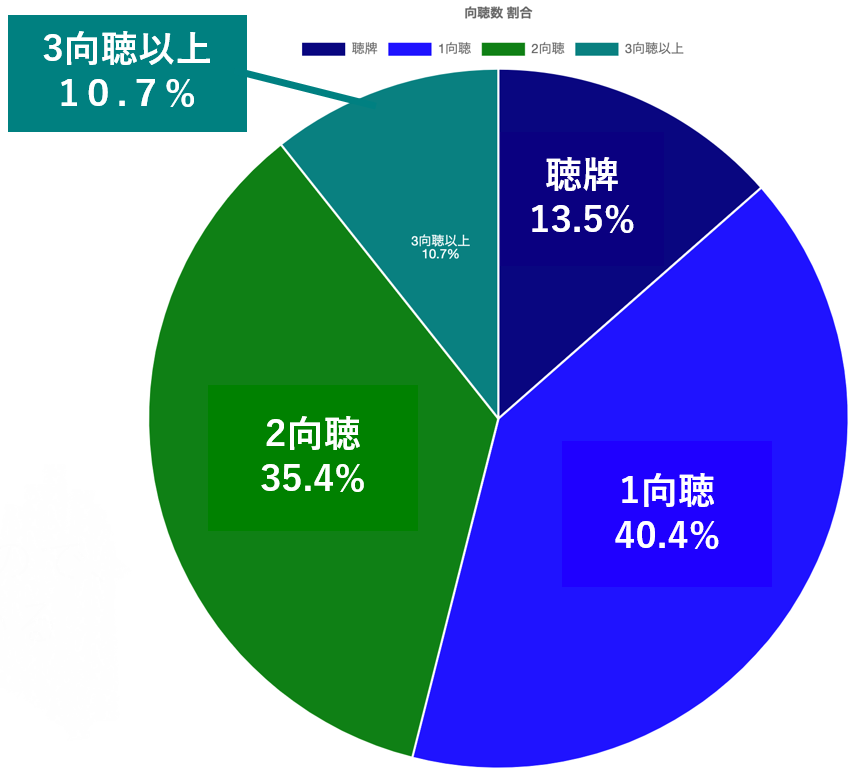

# tenho-analyze
1. 天鳳で公開しているmjscore形式の[牌譜](https://tenhou.net/man/)を解析して、プレイヤーの捨て牌状況をJSON形式で出力します
2. [不要牌類似計量方式](https://ipsj.ixsq.nii.ac.jp/ej/index.php?active_action=repository_view_main_item_detail&page_id=13&block_id=8&item_id=210937&item_no=1)を用いた捨て牌同士のメトリックを計量します
### 麻雀
- syanten.py：手牌の向聴数を
- generate.py：ひとまとまりのファイルを局ごとに分割したものにします
- mjscore_split.py：局の捨て牌を分析して、プレイヤーごとの捨て牌を出力します
- river_distance.py：不要牌類似計量方式を用いた距離計算を行う

### 環境
- python3.8
